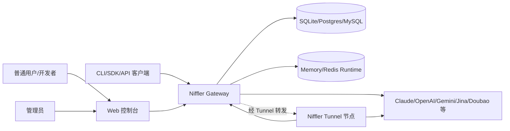

# Niffler 项目分析文档索引

本文档集基于当前仓库代码、配置、已有文档和部署脚本整理，面向产品理解、用户使用、功能设计、架构评审和后续优化。

## 文档清单

| 文档 | 目的 | 主要读者 |
| --- | --- | --- |
| [业务说明文档](business-overview.md) | 说明 Niffler 的业务定位、用户角色、业务闭环和价值 | 产品、运营、项目负责人 |
| [用户使用手册](user-manual.md) | 说明部署、登录、配置、调用 API、查看用量和管理 Tunnel 的操作方式 | 管理员、普通用户、运维 |
| [功能设计文档](functional-design.md) | 说明功能模块、页面能力、API 能力、权限和关键流程 | 产品、前端、后端、测试 |
| [架构设计文档](architecture-design.md) | 说明系统组成、请求链路、数据层、运行时、Tunnel 和部署架构 | 架构师、后端、运维 |
| [优化建议文档](optimization-recommendations.md) | 从用户体验、架构、性能、代码质量、bug 风险等角度提出改进建议 | 项目负责人、研发团队 |

## 总体判断

Niffler 是一个自托管 AI API 网关与管理平台。它把 OpenAI、Claude、Gemini、Jina、Doubao 等多类 API 统一成可管理、可计费、可审计、可路由的服务入口，并提供 Web 控制台和可选的海外 Tunnel 节点。

## 主要事实来源

| 类型 | 路径 |
| --- | --- |
| 项目定位与部署 | `README.md`、`.env.example`、`docker-compose.yml`、`docker-compose.single-node.yml`、`Makefile` |
| 后端入口与路由 | `apps/aether-gateway/src/main.rs`、`apps/aether-gateway/src/router.rs`、`apps/aether-gateway/src/api/*`、`apps/aether-gateway/src/control/route/*`、`apps/aether-gateway/src/handlers/proxy/mod.rs` |
| 前端控制台 | `frontend/src/router/index.ts`、`frontend/src/layouts/MainLayout.vue`、`frontend/src/api/*`、`frontend/DESIGN_SYSTEM.md` |
| Tunnel | `apps/aether-tunnel/README.md`、`apps/aether-tunnel/src/main.rs`、`apps/aether-tunnel/src/app.rs`、`apps/aether-tunnel/src/tunnel/client.rs` |
| 数据与运行时 | `crates/aether-data/*`、`docs/architecture/data-schema-inventory.md`、`docs/architecture/usage-counter-rootfix.md` |
| API 专项说明 | `docs/api/embeddings.md`、`docs/api/rerank.md`、`docs/architecture/gemini-api-endpoint-routing.md` |
