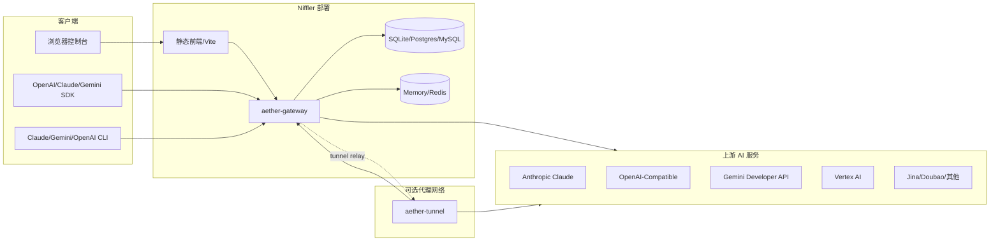
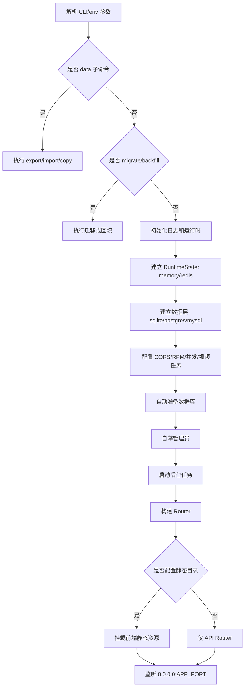
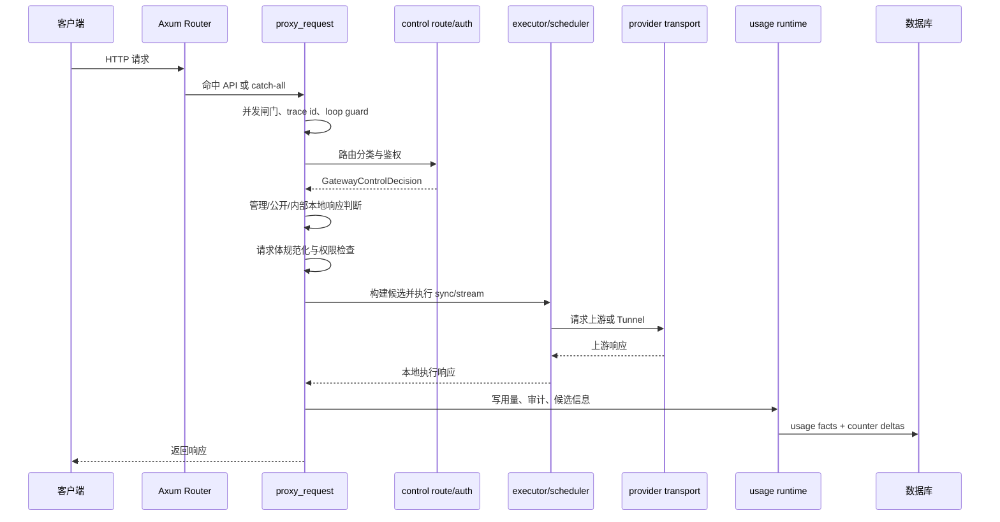
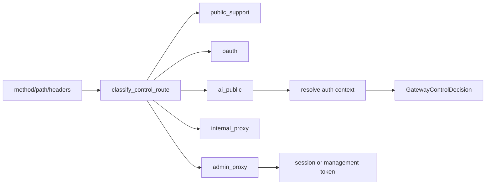
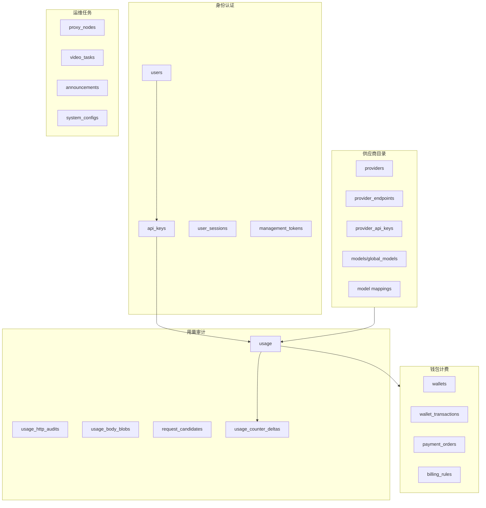
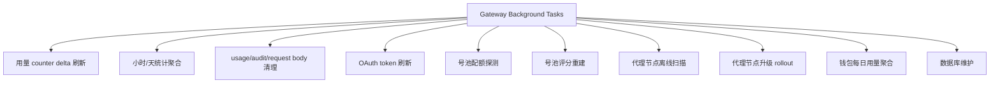
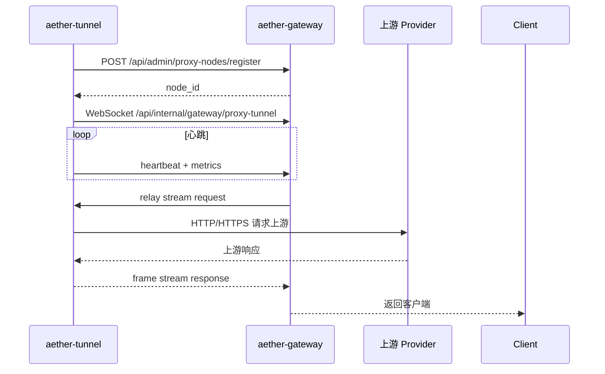
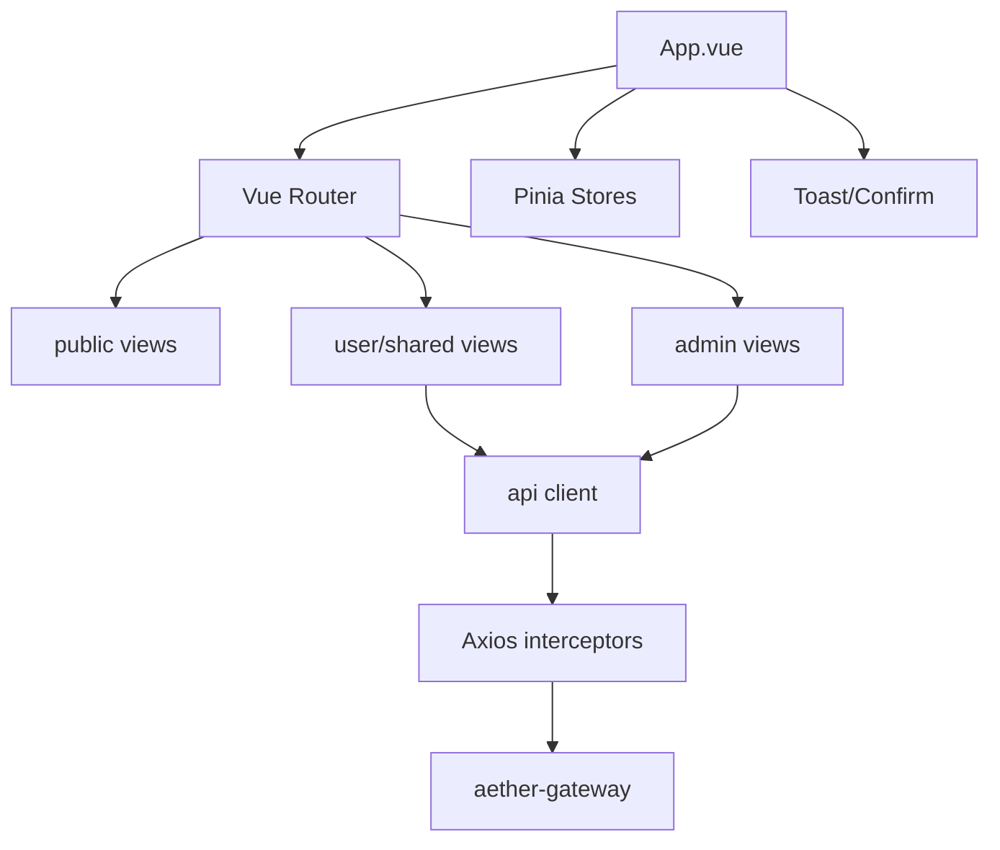

# Niffler 架构设计文档

## 架构结论

Niffler 当前是 Rust 后端工作区 + Vue 管理控制台 + Rust Tunnel agent 的组合架构。`aether-gateway` 是主进程，负责 HTTP 入口、控制面 API、本地执行调度、用量计费和静态前端托管；`crates/*` 承载领域逻辑；`frontend` 提供控制台；`aether-tunnel` 作为可选中转节点主动连接网关。

## 系统上下文

## 代码组织

| 路径 | 职责 |
| --- | --- |
| `apps/aether-gateway` | 主网关服务、路由、中间件、控制 API、代理请求、后台任务 |
| `apps/aether-tunnel` | Tunnel 节点、注册、WebSocket 隧道、上游请求转发、服务管理 |
| `frontend` | Vue 3 控制台、公开首页、用户端和管理端 |
| `crates/aether-ai-formats` | AI 请求/响应格式转换 |
| `crates/aether-ai-serving` | AI 服务契约、计划、候选材料化 |
| `crates/aether-provider-transport` | 上游 provider transport、URL 构造、OAuth 刷新等 |
| `crates/aether-routing-core` | 路由策略、规则、trace 相关纯逻辑 |
| `crates/aether-pool-core`、`aether-provider-pool` | 号池调度和 provider 行为适配 |
| `crates/aether-data` | 数据访问、迁移、schema、repository |
| `crates/aether-runtime-state` | Memory/Redis 运行时状态、分布式信号量 |
| `crates/aether-usage-runtime` | 用量事件、队列、写入和计数刷新 |
| `crates/aether-billing`、`aether-wallet` | 计费和钱包领域逻辑 |

## Gateway 启动架构

## Gateway 路由结构

`build_router_with_state` 的路由顺序是：

| 路由层 | 主要路径 | 说明 |
| --- | --- | --- |
| Core | `/.well-known/aether/frontdoor.json`、`/-/readyz`、`/_gateway/health` | manifest、健康检查 |
| Operational | `/_gateway/metrics`、`/_gateway/audit/*`、`/_gateway/async-tasks/*` | metrics、审计、异步任务 |
| AI | `/v1/*`、`/v1beta/*`、`/upload/*` | OpenAI/Claude/Gemini 兼容入口 |
| Public Support | `/api/public/*`、`/api/capabilities*`、`/install*` | 公开模型、站点能力、安装入口 |
| OAuth | `/api/oauth/*`、`/api/user/oauth/*` | OAuth provider 和用户绑定 |
| Internal | `/api/internal/gateway/*`、Tunnel 路径 | 内部控制与 Tunnel |
| Admin | `/api/admin/*` | 管理控制面 |
| Catch-all | `/{*path}` | 统一代理入口，未识别则本地返回 |

## 请求执行链路

## 路由决策模型

`GatewayControlDecision` 包含 public path、route class、route family、route kind、auth endpoint signature、是否执行候选、用户鉴权上下文和管理员主体。

## 数据架构

数据层特点：

| 设计点 | 说明 |
| --- | --- |
| 多数据库 | 支持 SQLite、Postgres、MySQL |
| Repository 分层 | 每类业务对象有 memory/mysql/postgres/sqlite 实现 |
| Schema 源 | `schema/logical/*.toml` 是长期维护源，runtime 使用 migrations |
| 导入导出 | `aether-gateway export/import/copy` 支持跨库迁移 |
| 热计数 | Postgres 用 `usage_counter_deltas` outbox 和 worker 降低热行锁 |

## 运行时状态与缓存

| 组件 | 作用 |
| --- | --- |
| `RuntimeState` | Memory/Redis 后端，承载 KV、信号量、队列等运行时状态 |
| 本地并发闸门 | 限制单节点最大在途请求 |
| 分布式并发闸门 | 多节点时通过 Redis 限制全局在途请求 |
| RPM 限流 | 用户/API Key 每分钟请求限制，支持 Redis 和 memory |
| AuthContextCache | 缓存鉴权上下文 |
| SchedulerAffinityCache | 缓存调度亲和信息 |
| DashboardResponseCache | 缓存仪表盘响应 |
| SystemConfigCache | 缓存系统配置 |
| DirectPlanBypassCache | 缓存直接计划绕过策略 |

## 后台任务

关键默认周期来自 `apps/aether-gateway/src/maintenance/runtime.rs`：

| 任务 | 默认周期 |
| --- | --- |
| Proxy 节点离线扫描 | 5 秒 |
| Pending 请求清理 | 5 分钟 |
| OAuth token 刷新 | 60 秒 |
| 用量 counter flush | 1 秒 |
| 用量 delta 清理 | 60 秒 |
| Proxy 升级 rollout | 15 秒 |
| 审计日志清理 | 24 小时 |
| Gemini 文件映射清理 | 1 小时 |

## Tunnel 架构

Tunnel 设计要点：

| 设计点 | 说明 |
| --- | --- |
| 主动连回 | VPS 节点不需要开放入站端口 |
| 多服务器 | `aether-tunnel.toml` 支持多个 `[[servers]]` |
| 自动 sizing | 根据硬件估算连接数和最大 stream |
| 连接池扩缩容 | 根据占用率扩容和缩容 |
| 出口代理 | 支持 `http://`、`socks5://`、`socks5h://` |
| 目标限制 | 支持 allowed ports、private target 策略和 DNS 缓存 |
| 诊断 | 可选 diagnostics server、Prometheus、健康统计 |

## 前端架构

| 层 | 说明 |
| --- | --- |
| `App.vue` | 全局错误、模块加载失败、跨标签页认证同步、Toast 和确认弹窗 |
| `router/index.ts` | 公开、用户、管理员路由和权限守卫 |
| `stores/auth.ts` | 用户、token、角色、登录、登出、会话检查 |
| `api/client.ts` | Axios、token 注入、refresh、demo adapter、跨标签页刷新协调 |
| `layouts/MainLayout.vue` | 控制台 shell、侧边栏、移动端菜单、公告、更新提示 |
| `features/*` | 供应商、模型、路由、用量、用户、钱包等领域组件 |
| `components/ui` | shadcn 风格基础组件 |

## 部署架构

| 模式 | 组件 | 适用场景 |
| --- | --- | --- |
| Docker Compose 标准版 | App + Postgres + Redis | 多人、生产、需要持久用量和共享运行时 |
| Compose Single Node | App + SQLite + memory runtime | 个人、小团队、部署简单 |
| 系统服务 Single Node | systemd/launchd + SQLite | 长期单机运行 |
| Multi Node | 多个 Gateway + Postgres + Redis | 横向扩展，需共享 runtime |
| Tunnel 节点 | 独立 `aether-tunnel` 服务 | 海外转发、网络隔离 |

## 安全架构

| 机制 | 说明 |
| --- | --- |
| JWT 和 refresh cookie | 控制台登录与会话刷新 |
| API Key | 用户调用 AI API 的凭证 |
| 管理令牌 | 自动化、Tunnel 和管理 API 凭证，支持权限和 IP 限制 |
| 敏感数据加密 | Provider API Key 等使用 `ENCRYPTION_KEY` |
| CORS | 根据环境和 `CORS_ORIGINS` 控制跨域 |
| Cloudflare header stripping | 防止外部伪造特定代理头 |
| TLS 指纹记录 | 支持 incoming/outgoing TLS 元数据审计 |
| IP 安全 | 管理端提供黑白名单能力 |

## 架构优势与主要约束

| 类型 | 说明 |
| --- | --- |
| 优势 | 领域 crate 拆分较完整，便于把格式、调度、数据、计费独立演进 |
| 优势 | 请求链路审计信息丰富，适合排查复杂调度问题 |
| 优势 | 部署形态覆盖个人和团队场景 |
| 约束 | `aether-gateway` 仍承担大量职责，文件和模块复杂度较高 |
| 约束 | 多数据库支持增加 repository 和 migration 维护成本 |
| 约束 | 多格式转换和兼容路径多，回归测试必须持续覆盖 |
