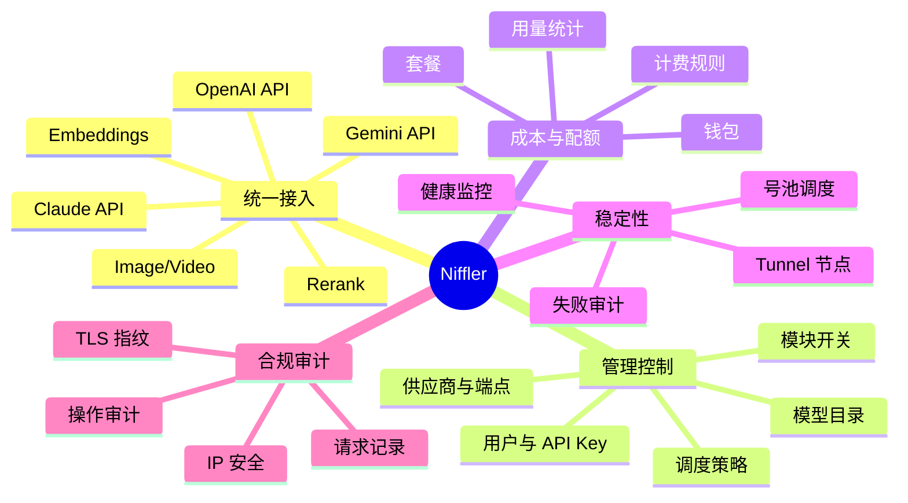
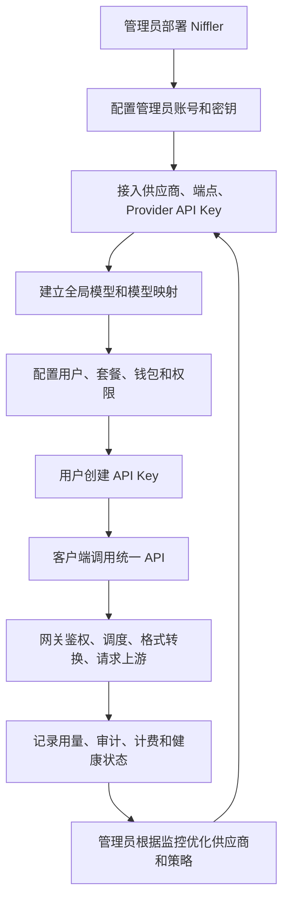

# Niffler 业务说明文档

## 业务定位

Niffler 是一个自托管 AI 基础设施平台，核心业务是把多个上游 AI 服务统一接入到一个可控网关中，让团队或个人可以集中管理模型、供应商密钥、用户权限、费用、配额、健康状态和审计记录。

它不是单纯的反向代理。当前代码显示，Niffler 同时承担控制台、鉴权、模型目录、供应商调度、格式转换、用量计费、钱包支付、健康监控、异步任务、审计和可选 Tunnel 中转。

## 目标用户

| 用户角色 | 主要诉求 | 典型操作 |
| --- | --- | --- |
| 平台管理员 | 搭建统一 AI 服务入口，控制用户、成本和可用性 | 部署服务、配置供应商、配置模型、管理用户、查看监控 |
| 审计管理员 | 查看日志和统计，但不直接修改业务配置 | 查看用量、审计日志、监控和异常记录 |
| 普通用户 | 获取 API Key，调用统一模型，查看自己的消费和状态 | 登录控制台、创建密钥、查看模型目录、调用 API |
| API 调用方 | 用 OpenAI/Claude/Gemini 兼容接口调用模型 | 通过 `/v1/*`、`/v1beta/*` 请求 Niffler |
| Tunnel 节点维护者 | 在海外 VPS 部署转发节点，提高上游访问稳定性 | 安装 `aether-tunnel`、注册节点、查看状态和日志 |

## 业务闭环

## 核心业务对象

| 业务对象 | 含义 | 代码或数据依据 |
| --- | --- | --- |
| 用户 | 登录控制台和拥有 API Key 的主体，含 admin、audit_admin、普通用户 | `users`、`frontend/src/stores/auth.ts` |
| API Key | 用户或管理员创建的调用凭证，可限制模型、格式、并发和用量 | `api_keys`、`frontend/src/api/me.ts`、`frontend/src/api/admin.ts` |
| 管理令牌 | 给自动化和 Tunnel 使用的管理员级 Token，支持权限和 IP 限制 | `management_tokens`、`frontend/src/api/management-tokens.ts` |
| Provider | 上游服务提供商，如 OpenAI、Anthropic、Google、Vertex AI | `providers`、`provider_catalog` |
| Provider API Key | 上游账号或密钥，可参与号池调度、健康检测、余额/配额管理 | `provider_api_keys` |
| Endpoint | Provider 的具体 API 端点和格式，如 `openai:chat`、`gemini:embedding` | `provider_endpoints` |
| Global Model | 对用户暴露的统一模型名和能力描述 | `global_models` |
| 路由策略 | 决定请求匹配哪些模型、供应商、端点和号池 | `routing_profiles`、`aether-routing-core` |
| 用量记录 | 每次请求的事实、费用、token、延迟、失败信息和审计信息 | `usage`、`usage_http_audits`、`usage_counter_deltas` |
| 钱包与套餐 | 用户余额、交易、充值、退款、套餐权益和计费规则 | `wallets`、`billing_rules`、`payment_orders` |
| Proxy Node | Tunnel 或手工代理节点，用于绕路访问上游 | `proxy_nodes`、`aether-tunnel` |

## 业务能力地图

| 能力域 | 当前能力 | 价值 |
| --- | --- | --- |
| 多格式接入 | OpenAI Chat、Responses、Embeddings、Rerank、Image、Video；Claude Messages；Gemini Generate、Embedding、Files、Video | 降低客户端接入成本 |
| 格式转换 | OpenAI、Claude、Gemini 等请求/响应互转 | 允许用一种客户端访问多类供应商 |
| 智能调度 | 供应商池、号池、优先级、健康、延迟、成本、配额和缓存亲和 | 提高成功率并控制成本 |
| 成本控制 | 钱包、套餐、计费规则、用量统计、成本分析 | 支撑团队内部分摊或商业化 |
| 多租户管理 | 用户、用户组、API Key、模型权限、独立密钥 | 支撑多人或组织使用 |
| 观测审计 | Dashboard、Prometheus metrics、审计日志、请求链路、候选 trace、TLS 指纹 | 支撑问题排查和安全审计 |
| 可选 Tunnel | 海外节点主动连回 Niffler，无需开放入站端口 | 改善网络受限场景下的上游访问 |
| 运维迁移 | Docker Compose、Single Node、Postgres 到 SQLite 迁移脚本 | 降低部署和迁移门槛 |

## 与普通 API 代理的区别

| 维度 | 普通代理 | Niffler |
| --- | --- | --- |
| 模型接入 | 转发某一类 API | 统一多供应商、多格式、多模型 |
| 用户管理 | 通常没有 | 用户、角色、用户组、会话、LDAP/OAuth |
| 权限控制 | 只看一个转发密钥 | 用户模型权限、API Key 权限、管理令牌权限 |
| 成本管理 | 通常不记录或粗略记录 | 请求级用量、钱包、套餐、成本预测和统计 |
| 可用性 | 固定上游 | 健康检测、号池调度、故障转移、Tunnel |
| 可审计性 | 日志为主 | 请求事实、审计日志、候选 trace、TLS 指纹 |

## 当前成熟度判断

| 方面 | 判断 |
| --- | --- |
| 业务覆盖 | 覆盖从接入、管理、调用、计费到审计的完整闭环，能力面较广 |
| 工程形态 | Rust 工作区 + Vue 控制台 + 可选 Tunnel，已经从脚本型项目演进到多 crate 架构 |
| 运维能力 | 支持标准 Compose、single-node、迁移脚本、健康检查、日志轮转 |
| 风险重点 | 功能面很宽，后端代码体量大，部分兼容和兜底链路仍需继续收敛 |
