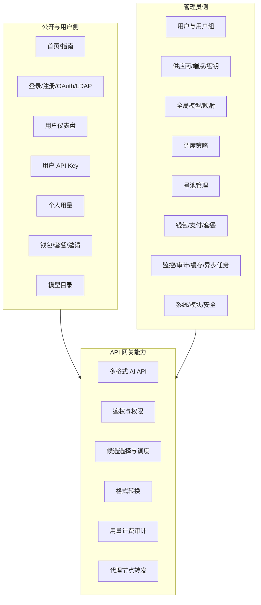
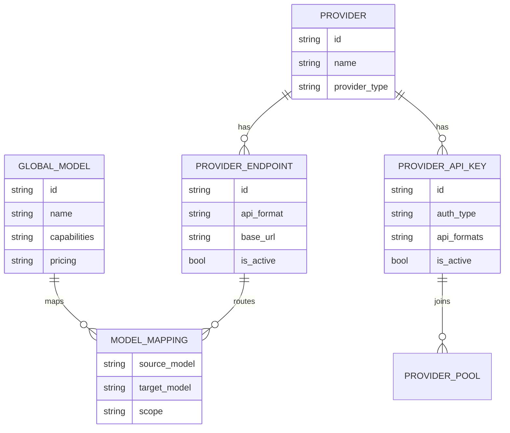
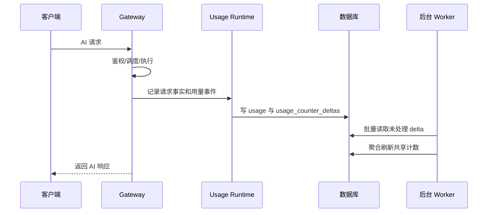
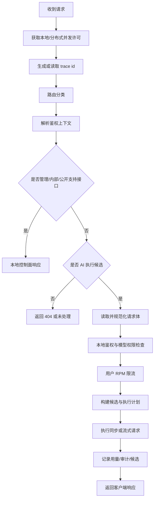
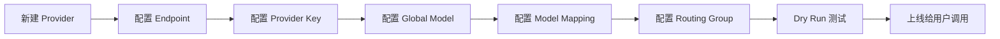

# Niffler 功能设计文档

## 功能总览

## 角色与权限

| 角色 | 访问范围 | 主要限制 |
| --- | --- | --- |
| 未登录访客 | 首页、指南、公开模型、公开健康信息、登录注册 | 不能创建 API Key，不能调用需认证接口 |
| 普通用户 | 用户仪表盘、API Key、用量、钱包、套餐、模型目录、公告 | 只能访问自己相关的数据和被授权模型 |
| 审计管理员 | 管理端可读视图和审计相关页面 | 不应执行配置修改类操作 |
| 管理员 | 全部管理功能 | 需保护管理令牌、系统配置和密钥操作 |
| 管理令牌 | 按权限访问管理 API 或 Tunnel 注册 | 受 token 权限、有效期和 IP 限制 |

## 功能模块设计

### 1. 认证与账号

| 功能 | 说明 | 前端入口 | 后端/数据依据 |
| --- | --- | --- | --- |
| 本地登录 | 邮箱密码登录，返回 access token 和 refresh cookie | 登录弹窗 | `/api/auth/login` |
| 注册与邮箱验证 | 支持注册设置、发送验证码、验证邮箱 | 注册弹窗 | `/api/auth/register`、`/api/auth/send-verification-code` |
| Token 刷新 | 401 后尝试刷新并重放请求 | `frontend/src/api/client.ts` | `/api/auth/refresh` |
| OAuth 登录/绑定 | 用户绑定第三方 OAuth，管理员配置 provider | OAuth 页面 | `oauth_providers`、`user_oauth_links` |
| LDAP | 管理员配置 LDAP 并测试 | LDAP 设置 | `ldap_configs` |
| 会话管理 | 用户查看和删除会话 | 个人设置 | `/api/users/me/sessions` |

### 2. 用户与 API Key

| 功能 | 说明 |
| --- | --- |
| 用户管理 | 管理员创建、编辑、禁用、删除、批量操作用户 |
| 用户组 | 管理默认组、组成员和组级策略 |
| 用户 API Key | 用户创建自己的调用密钥 |
| 管理员独立密钥 | 管理员创建或管理全局/独立密钥 |
| 密钥权限 | 支持模型、API Format、并发、RPM 等限制 |
| 最近使用 | 后台记录密钥最后使用时间和使用计数 |

### 3. 模型与供应商

| 功能 | 说明 |
| --- | --- |
| Provider 管理 | 创建供应商，维护类型、基础配置和状态 |
| Endpoint 管理 | 配置上游 URL、API Format、默认路径、重试、健康检测 |
| Provider Key 管理 | 配置上游 API Key、OAuth 账号、可用模型、配额和优先级 |
| 全局模型管理 | 对用户暴露统一模型名、能力、价格和描述 |
| 模型映射 | 支持别名、正则映射、provider 级映射 |
| 外部模型拉取 | 从供应商拉取或同步模型列表 |
| 连接测试 | 针对模型、供应商、端点进行测试 |

### 4. AI API 接入

| 客户端接口 | 路径 | 路由族 | 备注 |
| --- | --- | --- | --- |
| OpenAI Chat | `POST /v1/chat/completions` | `openai/chat` | 支持流式与非流式 |
| OpenAI Responses | `POST /v1/responses`、`/v1/responses/compact` | `openai/responses` | 支持 Responses 格式 |
| OpenAI Embeddings | `POST /v1/embeddings` | `openai/embedding` | 不支持 streaming |
| OpenAI Rerank | `POST /v1/rerank` | `openai/rerank` | 可转 OpenAI/Jina rerank |
| OpenAI Image | `POST /v1/images/generations`、`/v1/images/edits` | `openai/image` | 图片生成/编辑 |
| OpenAI Video | `/v1/videos*` | `openai/video` | 视频异步任务 |
| Claude Messages | `POST /v1/messages` | `claude/messages` | 支持 API key 与 bearer-like |
| Claude Count Tokens | `POST /v1/messages/count_tokens` | `claude/count_tokens` | 非执行 runtime 候选 |
| Gemini Generate | `/v1beta/models/{model}:{action}` | `gemini/generate_content` | 支持 CLI 检测 |
| Gemini Embedding | `embedContent`、`batchEmbedContents` | `gemini/embedding` | 支持 Developer API 与 Vertex 语义 |
| Gemini Files | `/upload/v1beta/files`、`/v1beta/files*` | `gemini/files` | 文件映射和清理 |

### 5. 调度与路由

| 功能 | 说明 |
| --- | --- |
| 路由分类 | 根据 method、path、headers 识别 `ai_public`、`admin_proxy`、`public_support`、`internal_proxy` 等 |
| 鉴权上下文 | 解析用户、API Key、模型权限、管理令牌权限 |
| 候选选择 | 根据模型、格式、供应商、端点、密钥、策略生成候选 |
| 调度策略 | 支持优先级、健康、延迟、成本、配额、缓存亲和、单账号等策略 |
| Dry Run | 管理端可测试某个请求会命中哪些路由和候选 |
| 失败处理 | 本地执行路径缺失、密钥并发限制、过载、限流等有明确响应路径 |

### 6. 用量、计费与钱包

| 功能 | 说明 |
| --- | --- |
| 请求事实 | 记录 request_id、用户、密钥、模型、供应商、状态、延迟 |
| Token 与费用 | 记录 input/output/total token、成本、实际成本 |
| 请求体审计 | 可记录请求、上游请求、响应、压缩大字段 |
| 钱包 | 余额、流水、今日成本、充值、退款、兑换码 |
| 套餐 | 套餐权益、购买限制、结算快照 |
| 统计 | 用户、API Key、模型、供应商、错误、性能、成本等聚合 |

### 7. 监控、审计与维护

| 功能 | 说明 |
| --- | --- |
| 健康检查 | `/_gateway/health`、`/-/readyz`、`/v1/health` |
| Prometheus | `/_gateway/metrics` |
| 请求审计 | request audit、usage audit、decision trace、candidate trace |
| TLS 指纹 | 记录 incoming 和 outgoing TLS 配置/指纹信息 |
| 缓存监控 | 查看缓存统计、模型映射缓存、Redis key 和亲和分析 |
| 清理任务 | 清理 usage、audit logs、request bodies、stats、proxy node metrics |
| 后台任务 | 用量计数刷新、统计聚合、OAuth 刷新、号池探测、代理升级等 |

### 8. Tunnel 与代理节点

| 功能 | 说明 |
| --- | --- |
| 节点注册 | Tunnel 用管理令牌调用 `/api/admin/proxy-nodes/register` |
| WebSocket 隧道 | 节点连接 `/api/internal/gateway/proxy-tunnel` |
| 连接池 | 自动估算连接数、每连接最大 stream、扩缩容阈值 |
| 目标过滤 | 控制可代理端口、私网地址策略、DNS 缓存 |
| 心跳上报 | 上报硬件、稳定性、连接、错误和 RTT 指标 |
| 节点升级 | 管理端支持安装会话、升级、取消、冲突清理和恢复跳过 |

## 关键流程

### AI 请求处理流程

### 管理端配置供应商流程

## 非功能设计

| 维度 | 设计 |
| --- | --- |
| 可用性 | 多供应商、多密钥、健康检测、fallback metric、Tunnel |
| 安全 | JWT、refresh cookie、管理令牌权限、IP 白名单/黑名单、敏感数据加密 |
| 可观测 | trace id、访问日志、Prometheus、审计、request candidate trace |
| 可扩展 | 多 crate 拆分，格式转换、供应商 transport、调度、数据层分离 |
| 可部署 | Compose 标准版、single-node、系统服务、迁移脚本 |
| 可维护 | schema manifest、migration/backfill、测试目录覆盖较广 |

## 功能边界

| 边界 | 说明 |
| --- | --- |
| Niffler 不提供上游模型本身 | 它负责调度和转发，不托管模型推理 |
| OpenAI-compatible 和 native Gemini/Vertex 不混用 | 代码和现有设计强调后端产品面需要明确 |
| Single-node 适合小规模 | SQLite + memory runtime 不适合多节点并发部署 |
| 请求体审计需谨慎开启 | 大请求体会带来存储和隐私压力 |
