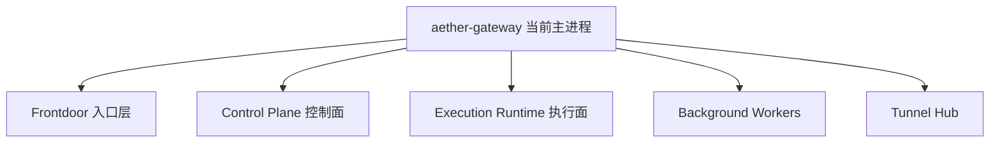
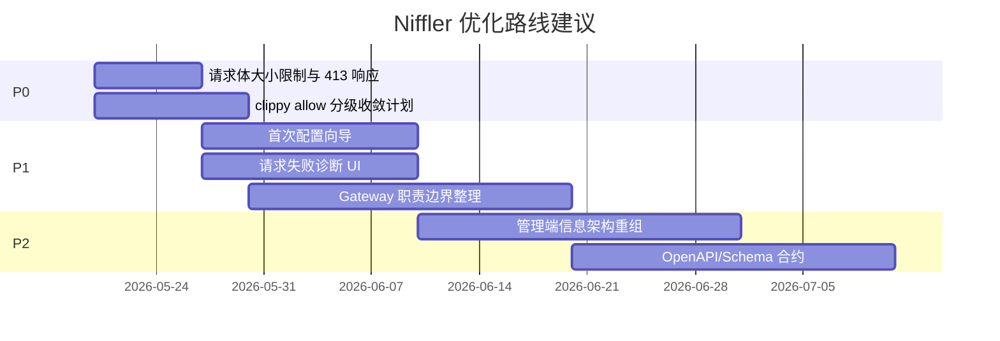

# Niffler 优化建议文档

## 结论摘要

Niffler 的功能完整度高，已经具备统一 AI 网关、控制台、计费审计和 Tunnel 的完整闭环。下一阶段优化重点不应继续横向堆功能，而应围绕“降低复杂度、提高稳定性、减少误配置、控制内存风险、提升用户配置成功率”推进。

## 优先级总表

| 优先级 | 方向 | 建议 | 预期收益 |
| --- | --- | --- | --- |
| P0 | 稳定性/安全 | 给请求体读取设置统一大小上限，替换高风险 `to_bytes(..., usize::MAX)` | 降低大包导致内存耗尽风险 |
| P0 | 代码质量 | 收敛 `aether-gateway/src/lib.rs` 顶层大量 `#![allow(...)]` | 恢复静态检查价值，减少隐藏缺陷 |
| P1 | 用户体验 | 提供“首次配置向导”：供应商、模型、Key、路由、测试一条链路完成 | 降低新用户配置失败率 |
| P1 | 架构 | 拆分 Gateway 控制面、执行面、运维后台任务边界 | 降低主进程复杂度 |
| P1 | 性能 | 对管理端列表、统计和大表查询建立慢查询监控与分页上限 | 降低大规模数据下的卡顿 |
| P1 | Bug 风险 | 梳理 fallback/兼容路由，建立删除计划和指标告警 | 减少隐性行为差异 |
| P2 | 前端质量 | 提取控制台信息架构，减少管理员菜单密度 | 提高可理解性 |
| P2 | 运维 | 增加部署前自检和配置诊断报告 | 降低环境变量、数据库、Redis 配错概率 |

## 用户体验建议

### 1. 增加首次配置向导

当前管理员需要理解供应商、端点、上游密钥、全局模型、模型映射、调度策略、用户权限等多个概念。建议新增一条可验证的向导：

| 改进点 | 说明 |
| --- | --- |
| 模板化 Provider | 针对 OpenAI、Anthropic、Gemini、Vertex AI 提供推荐默认值 |
| 自动建模 | 连接测试成功后自动生成全局模型和映射草稿 |
| 一键验证 | 用真实请求验证模型、权限、计费和路由 |
| 错误解释 | 把 403/503/调度 miss 转成“缺少模型权限/无可用 Key/端点不健康”等可行动提示 |

### 2. 降低管理员菜单密度

管理员侧当前菜单覆盖 20 多个入口。建议按任务重组：

| 当前分散入口 | 建议重组 |
| --- | --- |
| 提供商、模型管理、调度策略、号池管理 | 合并成“模型与上游”工作区，内部用步骤和标签页 |
| 钱包管理、支付配置、套餐管理、邀请返利 | 合并成“商业化”工作区 |
| 使用记录、用户统计、成本分析、性能分析、审计日志 | 合并成“观测与审计”工作区 |
| 模块管理、系统设置、缓存监控、IP 安全 | 合并成“系统与安全”工作区 |

### 3. 强化“为什么请求失败”

当前后端已经记录 decision trace、candidate trace、runtime miss diagnostics。建议前端在使用记录详情页给出可操作诊断：

| 错误类型 | 用户可见提示 |
| --- | --- |
| API Key 无模型权限 | “该密钥未授权模型 X，请在 API Key 权限中添加模型” |
| API Format 不匹配 | “请求是 embedding，但可用端点只有 chat” |
| Provider Key 并发满 | “上游账号并发已满，可增加 Key 或调高并发” |
| Endpoint 不健康 | “端点近期连续失败，已被调度跳过” |
| Vertex/Gemini 配置混用 | “当前端点像 Vertex，但认证或路径是 Gemini Developer API” |

### 4. 用户端模型目录增加“可调用样例”

每个模型详情页可自动生成 curl、OpenAI SDK、Claude SDK、Gemini SDK 示例，并根据用户 API Key 权限显示“当前是否可调用”。

## 架构设计建议

### 1. 拆分 Gateway 职责边界

`aether-gateway` 当前同时承担入口网关、控制面、本地执行、后台任务、静态前端和 Tunnel hub。建议逐步形成边界，而不是一次性拆服务：

| 阶段 | 动作 |
| --- | --- |
| 第一阶段 | 在代码层把 route/auth、admin handlers、executor、maintenance workers 明确成 crate 或子 crate |
| 第二阶段 | 把后台 worker 的配置、生命周期、失败重试和指标统一 |
| 第三阶段 | 允许多进程部署：frontdoor 节点和 background 节点分离 |

### 2. 继续推进领域 crate 下沉

已有 `aether-ai-formats`、`aether-provider-transport`、`aether-routing-core`、`aether-data` 等 crate。建议继续把以下逻辑从 gateway 下沉：

| 可下沉领域 | 原因 |
| --- | --- |
| 管理端 route family 定义 | 前后端、权限、文档和测试都可复用 |
| 管理令牌权限模型 | 独立于 Axum，可做纯函数测试 |
| 请求失败诊断模型 | 前端可消费标准错误码和建议 |
| 后台任务调度元数据 | 便于统一展示任务状态和下一次运行时间 |

### 3. 建立稳定的 API 合约层

当前前端 API 文件很多，后端 route family 也很丰富。建议生成或维护统一 OpenAPI/JSON Schema：

| 改进 | 收益 |
| --- | --- |
| 管理 API schema | 减少前后端字段漂移 |
| 错误码标准化 | 前端能稳定展示可行动提示 |
| API 兼容测试 | 防止管理端页面升级后接口不匹配 |

## 性能建议

### 1. 限制请求体读取大小

代码扫描发现网关和执行链路多处使用 `to_bytes(..., usize::MAX)`。这在面对超大请求或恶意请求时有内存风险。

建议：

| 动作 | 说明 |
| --- | --- |
| 统一 body limit 配置 | 例如 `AETHER_GATEWAY_MAX_REQUEST_BODY_BYTES` |
| 按接口分类限制 | chat、embedding、image、file upload 可有不同上限 |
| 对响应聚合设上限 | 只在确实需要聚合时读取完整 body |
| 超限返回明确错误 | 返回 413，并记录 trace id |

### 2. 管理端统计建立慢查询和缓存策略

项目已有 stats 聚合、dashboard cache 和 usage counter outbox。建议补齐：

| 建议 | 说明 |
| --- | --- |
| 慢查询日志 | 记录管理端超过阈值的查询参数和耗时 |
| 强制分页上限 | 大表列表默认 20，最大 100，不允许无上限导出走同步请求 |
| 导出异步化 | 用户、用量、审计大导出放入 background task |
| 统计预聚合 | 高频图表走 hourly/daily rollup，不直接扫 `usage` |

### 3. 多节点模式下减少本地状态依赖

代码中 single-node 可以 memory runtime，多节点要求 Redis。建议在启动自检中更强提示：

| 检查 | 失败处理 |
| --- | --- |
| multi-node 但 runtime 是 memory | 直接拒绝启动 |
| Redis 配置但不可用 | 根据 fail-open 策略给出明确告警 |
| RPM 限流 fallback 到本地 | 在 Prometheus 暴露指标并提醒限流不再全局准确 |

## 代码质量建议

### 1. 收敛顶层 clippy 放行

`apps/aether-gateway/src/lib.rs` 顶层放行了大量规则，包括 `dead_code`、`unused_*`、`too_many_arguments`、`type_complexity`、`result_large_err` 等。建议建立“逐项移除”计划。

| 阶段 | 动作 |
| --- | --- |
| 阶段 1 | 把全局 allow 改成模块级 allow，并写明原因 |
| 阶段 2 | 对 `unused_*`、`dead_code` 先启用 deny 或 warn |
| 阶段 3 | 对 `too_many_arguments` 和 `type_complexity` 建上下文结构体 |
| 阶段 4 | CI 加 `cargo clippy --workspace --all-targets` 非阻塞报告，再逐步阻塞 |

### 2. 控制文件和函数体积

项目总量约 86 万行，后端约 71 万行。建议把最复杂的 handler、execution、admin route 文件按领域进一步切分，并用纯函数承载可测试逻辑。

| 信号 | 风险 |
| --- | --- |
| 单文件过大 | review 和回归成本高 |
| 参数过多 | 调用方容易传错，测试构造困难 |
| 兼容分支多 | 行为难以预测 |
| 全局 allow 多 | 静态分析无法发挥作用 |

### 3. 减少测试代码和生产代码混杂

部分 `expect/unwrap` 在测试中可以接受，但生产路径应尽量返回错误。建议用脚本区分测试模块和生产模块，定期报告生产路径中的 `unwrap/expect/panic`。

## Bug 与稳定性风险

| 风险 | 依据 | 建议 |
| --- | --- | --- |
| 超大请求体导致内存压力 | 多处 `to_bytes(..., usize::MAX)` | 引入统一 body limit 和接口级上限 |
| 静态检查被弱化 | Gateway 顶层大量 `#![allow(...)]` | 分阶段收敛 allow |
| 兼容路由行为不清晰 | 前端保留旧路由、后端有 removed passthrough 语义 | 建兼容矩阵和下线日期 |
| Gemini/Vertex 混用 | 已有专项设计文档说明这是关键问题 | 在 UI 配置和后端校验中显式提示产品面 |
| Single-node 与 multi-node 行为差异 | memory/redis runtime、SQLite/Postgres 差异 | 启动诊断和文档中明确限制 |
| 请求体审计带隐私风险 | usage body blobs、TLS 指纹、审计记录 | 默认最小化采集，增加脱敏预览和保留期提示 |
| 管理端误操作 | 系统清理、导入、批量删除、代理升级等能力强 | 二次确认、dry-run、可回滚记录 |

## 安全建议

| 建议 | 说明 |
| --- | --- |
| 管理令牌默认最小权限 | 创建 Tunnel token 时只给代理节点相关权限 |
| 强制显示 token 作用域 | 管理端列表展示权限摘要、有效期、IP 限制 |
| 敏感配置检查 | 启动时检测默认 `JWT_SECRET_KEY`、`ENCRYPTION_KEY`、弱管理员密码 |
| CORS 配置诊断 | 跨域带 cookie 时禁止 `*`，并在 UI 中提示 |
| 请求体脱敏策略可视化 | 管理员能看到哪些字段会被记录、脱敏和清理 |

## 前端体验与质量建议

| 建议 | 说明 |
| --- | --- |
| API 错误统一解析 | 把后端 trace id、错误码、建议动作显示在页面上 |
| 表单状态完整化 | 所有高风险表单都有加载中、禁用、空状态、错误态 |
| 移动端管理页降级 | 管理页复杂表格在移动端改成卡片和关键操作 |
| 页面级帮助 | 在供应商、模型、调度策略页提供概念解释和推荐默认值 |
| Demo 数据标识 | Demo 模式下所有 mock 数据保持明显标识，避免误判真实状态 |

## 运维建议

| 建议 | 说明 |
| --- | --- |
| 增加 `aether-gateway doctor` | 检查数据库、Redis、密钥、迁移、CORS、管理员、端口 |
| 增加配置导出体检 | 导入前检查版本、字段、冲突和不可逆变更 |
| Tunnel 节点安装后自动回传诊断 | 上报版本、系统、出口 IP、DNS、目标端口测试结果 |
| 统一日志字段 | request_id、user_id、api_key_id、provider、model、execution_path |
| 明确 backup/restore 文档 | 尤其是 SQLite single-node 和 Postgres 标准部署 |

## 建议实施路线

## 可立即执行的检查清单

| 检查项 | 推荐命令或方式 |
| --- | --- |
| Rust 编译 | `cargo check --workspace` |
| Rust 测试 | `cargo test --workspace` |
| 前端类型 | `cd frontend && npm run type-check` |
| 前端测试 | `cd frontend && npm run test:run` |
| schema 漂移 | `bash crates/aether-data/schema/compose_schema.sh check` |
| 大请求体风险点 | `rg "to_bytes\\(.*usize::MAX" apps crates` |
| 生产路径 unwrap | `rg "unwrap\\(|expect\\(|panic!" apps crates -g '*.rs'` |
