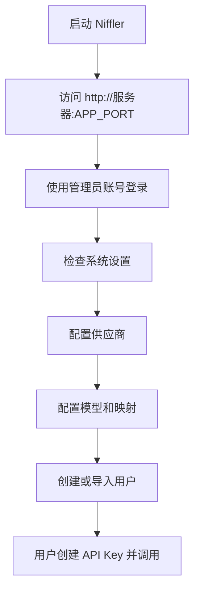
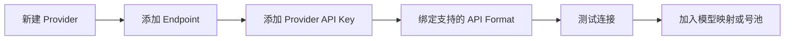

# Niffler 用户使用手册

## 适用对象

本手册面向三类使用者：

| 使用者 | 使用目标 |
| --- | --- |
| 管理员 | 部署 Niffler，配置供应商、模型、用户、计费和监控 |
| 普通用户 | 登录控制台，创建 API Key，调用模型，查看用量和钱包 |
| Tunnel 运维 | 在海外 VPS 安装 `aether-tunnel`，为 Niffler 提供转发节点 |

## 1. 部署 Niffler

### 1.1 Docker Compose 标准部署

适合多人、团队或生产部署。组件包含 Niffler App、Postgres、Redis。

```bash
git clone https://github.com/ryfineZ/Niffler.git
cd Niffler
cp .env.example .env
./generate_keys.sh
docker compose pull
docker compose up -d
```

| 配置项 | 说明 |
| --- | --- |
| `APP_PORT` | Niffler 对外端口，默认 `8084` |
| `DB_PASSWORD` | Postgres 密码 |
| `REDIS_PASSWORD` | Redis 密码 |
| `JWT_SECRET_KEY` | 登录 token 签名密钥 |
| `ENCRYPTION_KEY` | 上游密钥等敏感数据加密密钥 |
| `ADMIN_EMAIL` / `ADMIN_USERNAME` / `ADMIN_PASSWORD` | 首个管理员账号 |

### 1.2 Single Node 部署

适合个人或小团队。默认使用 SQLite 和内存运行时状态。

```bash
docker compose -f docker-compose.single-node.yml pull
docker compose -f docker-compose.single-node.yml up -d
```

### 1.3 本地开发

```bash
cp .env.example .env
make dev
```

`make dev` 会启动后端 `aether-gateway` 和前端 Vite 开发服务；本地 Postgres/Redis 不可用时，会尝试自动启动 Docker Compose 里的依赖。

## 2. 首次登录与基础配置



### 2.1 登录控制台

1. 打开 `http://<服务器地址>:<APP_PORT>`。
2. 使用 `.env` 中配置的管理员账号登录。
3. 进入管理员控制台后，优先检查系统设置、模块状态和健康监控。

### 2.2 建议的配置顺序

| 步骤 | 菜单 | 说明 |
| --- | --- | --- |
| 1 | 系统设置 | 确认站点信息、请求记录、清理策略、SMTP 等基础配置 |
| 2 | 提供商 | 添加 Anthropic、OpenAI、Google、Vertex AI 等供应商 |
| 3 | 提供商详情 | 添加端点、上游密钥、OAuth 账号或代理配置 |
| 4 | 模型管理 | 创建全局模型、配置能力、价格和映射 |
| 5 | 调度策略 | 设置模型到供应商、端点、号池的路由规则 |
| 6 | 用户管理 | 创建用户、用户组、模型权限和访问限制 |
| 7 | 套餐/钱包 | 如启用计费，配置套餐、充值、余额和退款 |

## 3. 管理员操作手册

### 3.1 控制台菜单

| 分组 | 菜单 | 用途 |
| --- | --- | --- |
| 概览 | 仪表盘 | 查看总体请求、成本、健康和最近请求 |
| 概览 | 健康监控 | 查看端点健康、成功率和异常 |
| 概览 | 用户统计 | 按用户、API Key、模型等维度分析 |
| 概览 | 成本分析 | 查看成本预测、节省情况、供应商成本 |
| 概览 | 性能分析 | 查看延迟、错误分布、fallback 指标 |
| 管理 | 用户管理 | 管理用户、用户组、批量操作和权限 |
| 管理 | 提供商 | 管理供应商、端点、密钥、OAuth、余额和健康 |
| 管理 | 模型管理 | 管理全局模型、模型映射、价格和能力 |
| 管理 | 调度策略 | 配置路由组、规则、绑定和 dry-run 测试 |
| 管理 | 号池管理 | 管理账号池、调度预设、配额和账号状态 |
| 管理 | 独立密钥 | 管理管理员创建的 API Key |
| 管理 | 钱包管理 | 管理用户钱包、流水、退款 |
| 管理 | 支付配置 | 配置支付网关、订单、回调、兑换码 |
| 管理 | 套餐管理 | 配置套餐和权益 |
| 管理 | 邀请返利 | 管理邀请关系和返利 |
| 管理 | 异步任务 | 查看视频任务和后台任务 |
| 管理 | 使用记录 | 查看请求级用量、请求体、错误和重放信息 |
| 系统 | 公告管理 | 发布公告、必读公告 |
| 系统 | 缓存监控 | 查看缓存命中、Redis key 和清理缓存 |
| 系统 | 模块管理 | 查看和配置 OAuth、LDAP、管理令牌等模块 |
| 系统 | 系统设置 | 管理配置导入导出、清理、站点、日志等 |

### 3.2 添加供应商

推荐流程：



常见 API Format：

| 客户端或上游格式 | 说明 |
| --- | --- |
| `openai:chat` | OpenAI Chat Completions |
| `openai:responses` | OpenAI Responses |
| `openai:embedding` | Embeddings |
| `openai:rerank` | Rerank |
| `openai:image` | 图片生成/编辑 |
| `openai:video` | 视频任务 |
| `claude:messages` | Claude Messages |
| `gemini:generate_content` | Gemini Generate Content |
| `gemini:embedding` | Gemini Embedding |
| `gemini:files` | Gemini Files |

### 3.3 配置模型

模型配置分三层：

| 层级 | 作用 |
| --- | --- |
| 全局模型 | 对用户展示和请求时使用的统一模型名 |
| Provider 模型 | 上游实际模型名 |
| 模型映射 | 把用户请求的模型映射到某个全局模型或供应商模型 |

建议每个模型至少配置：

| 配置 | 原因 |
| --- | --- |
| 支持能力 | 区分 chat、embedding、rerank、image、video |
| API Format | 防止把 embedding 请求调度到 chat 端点 |
| 价格 | 用于计费、成本分析和钱包扣费 |
| 显示名和说明 | 方便用户在模型目录中理解 |

### 3.4 配置调度策略

调度策略决定一次请求选择哪个供应商、端点和密钥。当前前端提供调度组、规则编辑、优先级策略和 dry-run 测试。

| 策略目标 | 可用做法 |
| --- | --- |
| 稳定优先 | 健康优先、失败转移、多端点备份 |
| 成本优先 | 成本优先、免费额度优先 |
| 延迟优先 | 延迟优先、区域就近、缓存亲和 |
| 账号池均衡 | 号池调度、配额均衡、最近刷新优先 |
| 特定用户隔离 | 用户组、模型权限、独立路由绑定 |

### 3.5 查看监控与审计

| 场景 | 查看位置 |
| --- | --- |
| 整体是否正常 | 仪表盘、健康监控、`/_gateway/health` |
| Prometheus 指标 | `/_gateway/metrics` |
| 某个请求为什么失败 | 使用记录、请求详情、request trace、candidate trace |
| 某个 API Key 当前状态 | API Key 快照、用量统计 |
| 供应商是否失效 | 健康监控、Provider 详情、端点状态 |
| 是否有可疑访问 | 审计日志、IP 安全、TLS 指纹 |

## 4. 普通用户操作手册

### 4.1 用户菜单

| 分组 | 菜单 | 用途 |
| --- | --- | --- |
| 概览 | 仪表盘 | 查看个人请求、消费和状态 |
| 概览 | 健康监控 | 查看可用模型或端点状态 |
| 资源 | 模型目录 | 查看可用模型、能力和说明 |
| 资源 | API 密钥 | 创建和管理自己的 API Key |
| 账户 | 钱包中心 | 查看余额、充值、退款和流水 |
| 账户 | 套餐中心 | 查看和购买套餐 |
| 账户 | 我的邀请 | 查看邀请和返利 |
| 账户 | 使用统计 | 查看自己的请求记录和用量 |

### 4.2 创建 API Key

1. 进入「API 密钥」。
2. 新建密钥。
3. 按需限制模型、API Format、并发或访问范围。
4. 保存后立即复制密钥，后续通常只能查看脱敏值。
5. 关闭创建成功提示后，选择「导入 CC Switch」或「一键配置」完成接入。

### 4.3 调用 OpenAI 兼容接口

Chat Completions：

```bash
curl -sS "http://localhost:8084/v1/chat/completions" \
  -H "Authorization: Bearer sk-your-aether-key" \
  -H "Content-Type: application/json" \
  -d '{
    "model": "your-global-model",
    "messages": [{"role": "user", "content": "你好"}]
  }'
```

Embeddings：

```bash
curl -sS "http://localhost:8084/v1/embeddings" \
  -H "Authorization: Bearer sk-your-aether-key" \
  -H "Content-Type: application/json" \
  -d '{
    "model": "text-embedding-3-small",
    "input": ["hello", "world"]
  }'
```

Rerank：

```bash
curl -sS "http://localhost:8084/v1/rerank" \
  -H "Authorization: Bearer sk-your-aether-key" \
  -H "Content-Type: application/json" \
  -d '{
    "model": "bge-reranker-base",
    "query": "Niffler 是什么？",
    "documents": ["Niffler 是 AI API 网关", "其他内容"]
  }'
```

### 4.4 调用 Claude 兼容接口

```bash
curl -sS "http://localhost:8084/v1/messages" \
  -H "x-api-key: sk-your-aether-key" \
  -H "anthropic-version: 2023-06-01" \
  -H "Content-Type: application/json" \
  -d '{
    "model": "your-claude-model",
    "max_tokens": 1024,
    "messages": [{"role": "user", "content": "你好"}]
  }'
```

### 4.5 调用 Gemini 兼容接口

```bash
curl -sS "http://localhost:8084/v1beta/models/your-gemini-model:generateContent" \
  -H "x-goog-api-key: sk-your-aether-key" \
  -H "Content-Type: application/json" \
  -d '{
    "contents": [{"parts": [{"text": "你好"}]}]
  }'
```

## 5. Tunnel 节点使用

Niffler Tunnel 部署在海外 VPS 上，主动通过 WebSocket 连回 Niffler。节点无需开放公网入站端口。

### 5.1 一键安装

```bash
curl -fsSL https://raw.githubusercontent.com/ryfineZ/Niffler/main/apps/aether-tunnel/install.sh | \
  AETHER_TUNNEL_AETHER_URL="https://aether.example.com" \
  AETHER_TUNNEL_MANAGEMENT_TOKEN="ae_xxx" \
  AETHER_TUNNEL_NODE_NAME="jp-proxy-01" \
  sh
```

Windows PowerShell：

```powershell
$env:AETHER_TUNNEL_AETHER_URL = "https://aether.example.com"
$env:AETHER_TUNNEL_MANAGEMENT_TOKEN = "ae_xxx"
$env:AETHER_TUNNEL_NODE_NAME = "jp-proxy-01"
irm https://raw.githubusercontent.com/ryfineZ/Niffler/main/apps/aether-tunnel/install.ps1 | iex
```

### 5.2 常用命令

| 命令 | 说明 |
| --- | --- |
| `aether-tunnel setup` | 交互式配置 |
| `aether-tunnel status` | 查看服务状态 |
| `sudo aether-tunnel logs` | 查看日志 |
| `sudo aether-tunnel start` | 启动服务 |
| `sudo aether-tunnel stop` | 停止服务 |
| `sudo aether-tunnel restart` | 重启服务 |
| `sudo aether-tunnel uninstall` | 卸载服务 |

## 6. 常见问题

| 问题 | 处理 |
| --- | --- |
| 登录后看不到管理菜单 | 确认用户角色是 `admin` 或 `audit_admin` |
| API 返回 403 | 检查用户、API Key、模型权限和 API Format 权限 |
| API 返回 503 且提示没有可用执行路径 | 检查模型映射、供应商端点、Provider API Key、健康状态和调度策略 |
| Embedding 请求失败 | 确认请求使用 `input`，不要使用 `messages`，并确认模型支持 embedding |
| Gemini/Vertex 请求打错端点 | 区分 Gemini Developer API 与 Vertex AI，不要混用 host、认证和 endpoint |
| Tunnel 节点离线 | 检查管理令牌、Niffler URL、节点出站网络、WebSocket 和服务日志 |
| 用量统计延迟 | 后台 worker 会异步刷新部分计数，短时间延迟属于正常现象 |
