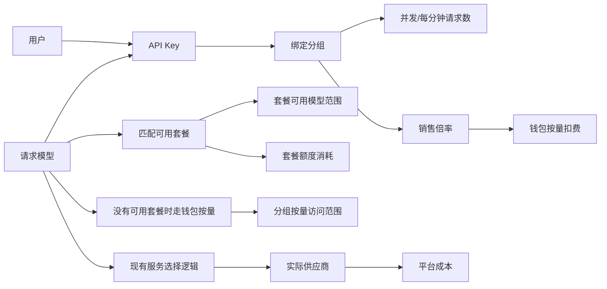
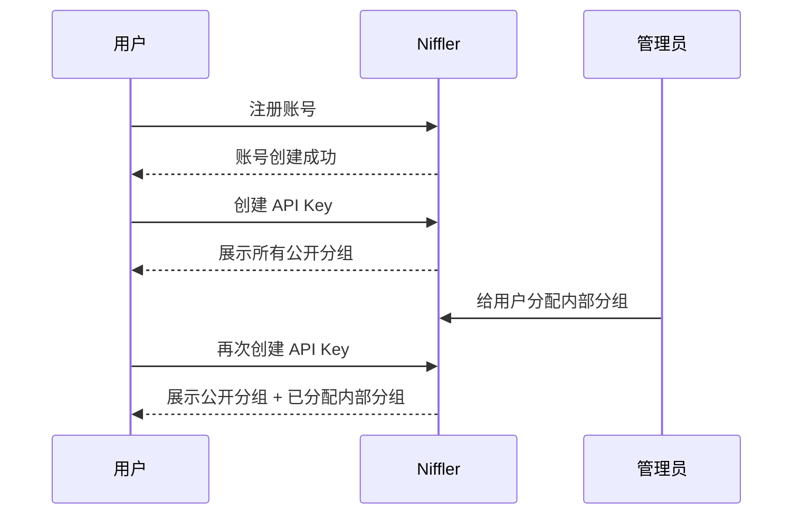
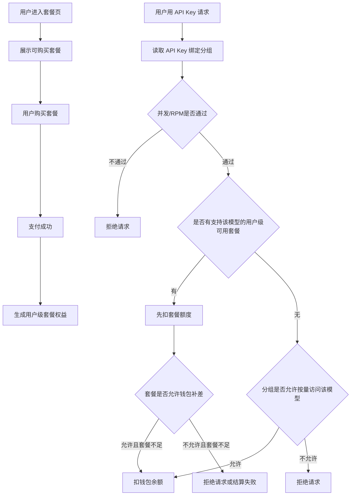
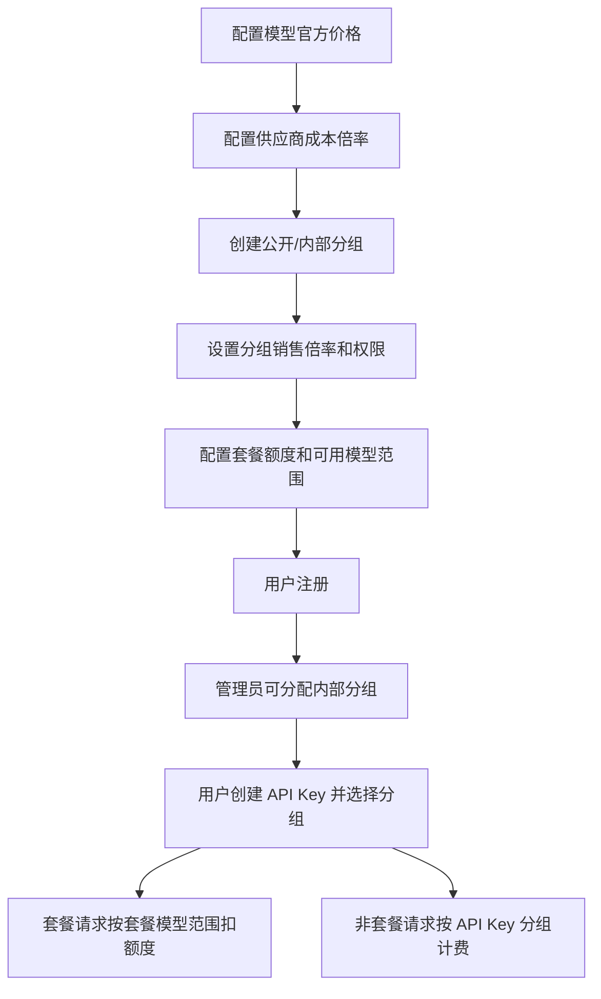

# 分组、API Key、按量计费与套餐设计

## 状态

本文档记录已确认的产品与架构方案。当前已实现套餐按全局模型限制、请求进上游前的套餐模型判断、结算按模型扣套餐、短时额度可用性缓存，以及后台套餐编辑页的直接模型选择和按提供商批量勾选。

本次实现范围：

| 范围 | 结果 |
|---|---|
| 分组公开/内部类型 | 落地到分组配置，公开分组所有用户可选，内部分组仅管理员分配后可选。 |
| API Key 绑定分组 | 用户创建和编辑 API Key 时绑定分组；历史 API Key 迁移到默认分组。 |
| 非套餐请求按绑定分组鉴权 | 供应商、接口格式、模型、并发和每分钟请求数按 API Key 绑定分组计算。 |
| 分组销售倍率 | 钱包按量扣费按模型官方价格乘以绑定分组倍率。 |
| 套餐额度计费 | 套餐额度继续按模型官方价格消耗，不乘分组销售倍率。 |
| 结算快照 | 使用记录保留请求当时的分组和倍率，避免后续改价影响历史请求。 |
| 套餐模型选择 | 套餐编辑页可以直接勾选模型，也可以按提供商批量加入当前关联模型。 |
| 利润统计展示 | 成本分析页展示用户扣费、平台成本、毛利和毛利率。 |
| 使用统计展示 | 用户侧展示模型官方价格、实际扣费和销售倍率；管理控制台额外展示平台成本和成本倍率。 |

后续增强：

| 范围 | 说明 |
|---|---|
| 提供商成本倍率独立配置 | 当前仍沿用已有供应商账号成本倍率；后续再补提供商默认成本倍率和供应商模型成本倍率覆盖。 |

## 目标

让 Niffler 的商业化规则足够清楚：

| 目标 | 说明 |
|---|---|
| 分组简单 | 分组只分公开分组和内部分组。 |
| API Key 身份明确 | 每个 API Key 必须绑定一个分组；分组影响钱包按量计费、并发和每分钟请求数，不限制已购买套餐能使用哪些模型。 |
| 钱包按量价格稳定 | 同一个模型对用户按同一个模型价格和分组倍率扣钱包，不因后台实际供应商变化而改变。 |
| 平台成本可算 | 平台成本按实际使用供应商的成本倍率计算，用于利润统计。 |
| 套餐边界清楚 | 套餐是用户级周期额度，只按自己的可用模型范围生效，和 API Key 分组解耦。 |

## 非目标

| 非目标 | 说明 |
|---|---|
| 不重做模型调度 | 同一个模型来自多个供应商时，继续沿用现有自动选择逻辑。 |
| 不做供应商级用户售价 | 第一版不支持同一模型因供应商不同而对用户收不同价格。 |
| 不引入复杂加入方式 | 不做用户申请、自助加入、邀请加入等多种分组加入流程。 |
| 不改变充值本质 | 充值只增加钱包余额，不改变用户分组。 |
| 不把按量计费做成套餐 | 按量计费没有有效期，直接从钱包扣款。 |
| 不给套餐加销售倍率 | 套餐额度按模型官方价格消耗，不乘分组销售倍率。 |
| 不让分组影响套餐权益 | 用户买到某个模型的套餐后，不应该因为 API Key 绑定了别的分组而无法使用。 |

## 核心规则



| 对象 | 规则 |
|---|---|
| 用户 | 可以拥有多个分组。 |
| 分组 | 只有公开分组和内部分组两类。 |
| 公开分组 | 所有用户创建 API Key 时都能看到和选择。 |
| 内部分组 | 只有管理员分配给用户后，该用户才能看到和选择。 |
| API Key | 创建时必须绑定一个用户可选分组。 |
| 套餐请求 | 只看套餐自己的可用模型范围、额度和有效期，不看 API Key 分组的可用模型。 |
| 钱包按量请求 | 没有可用套餐时，按 API Key 绑定分组判断可用供应商、接口格式、模型、并发、每分钟请求数和销售倍率。 |
| 同名模型多供应商 | 继续按现有逻辑自动选择实际供应商。 |
| 钱包按量扣费 | 按模型官方价格和 API Key 分组销售倍率计算。 |
| 套餐额度消耗 | 只有请求模型在套餐可用模型范围内，才按模型官方价格消耗套餐额度。 |
| 平台成本 | 按模型官方价格和实际供应商成本倍率计算。 |
| 套餐 | 用户级周期额度，不区分分组，但限制可用模型范围；模型在套餐范围内时可以共用。 |

## 分组设计

### 分组类型

| 类型 | 用户是否可见 | 用户是否可选 | 典型用途 |
|---|---:|---:|---|
| 公开分组 | 是 | 是 | 普通用户、公开体验用户。 |
| 内部分组 | 仅被分配用户可见 | 仅被分配用户可选 | 批发商、大客户、内部测试。 |

用户可选分组规则：

```text
用户可选分组 = 所有公开分组 + 管理员分配给该用户的内部分组
```

### 分组承载的配置

| 配置 | 作用 |
|---|---|
| 分组名称 | 用户创建 API Key 时看到的名称。 |
| 分组类型 | 公开或内部。 |
| 默认销售倍率 | 该分组默认按模型官方价格的多少倍扣费。 |
| 模型销售倍率覆盖 | 可选。不是第二个倍率；配置后直接替代默认销售倍率，只按全局模型设置，不按供应商设置。 |
| 可用供应商 | 限制这个分组能使用哪些供应商。 |
| 可用接口格式 | 限制这个分组能使用哪些接口格式。 |
| 可用模型 | 限制这个分组能使用哪些模型。 |
| 每分钟请求数 | 分组级请求频率限制。 |
| 并发数 | 分组级同时请求限制。 |

第一版可以直接把销售倍率放在分组上，不单独引入“价目表”对象。后续如果出现大量分组共用同一套价格，再考虑抽成独立价目表。

管理后台配置体验：

- 可用模型支持按提供商快速勾选，保存时仍写入全局模型名称列表。
- 模型销售倍率覆盖不要求管理员手写 JSON；界面用“模型 + 倍率”的表格编辑，保存时仍写入 `model_sales_multipliers`。
- 按提供商批量设置销售倍率只是批量给该提供商下的全局模型填倍率，不表示同一个模型会按实际供应商分别计费。

## 用户注册与 API Key 创建

### 注册后



| 场景 | 行为 |
|---|---|
| 新用户注册 | 不需要选择分组。 |
| 创建 API Key | 必须选择一个可选分组。 |
| 只有一个公开分组 | 前端可以默认选中，但提交时仍必须带分组。 |
| 用户没有任何可选分组 | 不能创建 API Key，提示联系管理员。 |
| 管理员分配内部分组 | 用户之后创建 API Key 时可以选择该内部分组。 |

### API Key 分组校验

| 操作 | 校验规则 |
|---|---|
| 创建 API Key | 绑定分组必须是公开分组，或用户已被分配的内部分组。 |
| 使用 API Key | API Key 绑定分组必须仍然有效。 |
| API Key 没有绑定分组 | 普通 API Key 视为无效，不再退回用户所属分组或默认 `1.0` 倍率。 |
| 独立密钥 | 不绑定用户分组，不使用分组销售倍率。 |
| 管理员移除用户内部分组 | 绑定该内部分组的 API Key 暂停使用，不自动切回公开分组。 |
| 管理员禁用分组 | 绑定该分组的 API Key 暂停使用。 |

不自动切换分组是为了避免用户实际扣费规则突然变化，造成对账困难。

分组里的可用供应商、可用接口格式和可用模型，只约束钱包按量请求。用户已经购买的套餐请求，按套餐自己的可用模型范围判断。

## 按量计费与套餐消耗

### 计费公式

```text
钱包按量扣费 = 模型官方价格 × API Key 绑定分组的销售倍率

套餐额度消耗 = 模型官方价格，前提是请求模型在套餐可用模型范围内

平台成本 = 模型官方价格 × 实际供应商成本倍率

平台利润 = 实际收入 - 平台成本
```

| 金额 | 含义 | 面向对象 |
|---|---|---|
| 模型官方价格 | 模型厂商公开价格，作为计费基准。 | 管理员、用户可见。 |
| 销售倍率 | 分组上的用户扣费倍率。 | 管理员配置，用户只看到自己的最终价格。 |
| 成本倍率 | 供应商或供应商模型上的平台成本倍率。 | 管理员内部使用。 |
| 钱包按量扣费 | 没有可用套餐、套餐不支持该模型，或套餐允许钱包补差时，从钱包扣除的金额；这部分受 API Key 分组影响。 | 用户可见。 |
| 套餐额度消耗 | 请求模型在套餐可用模型范围内时，从周期额度套餐中扣除的金额。 | 用户可见。 |
| 平台成本 | 平台内部成本统计。 | 管理员可见。 |

### 使用统计展示口径

| 页面 | 展示金额 | 说明 |
|---|---|---|
| 用户侧使用统计 | 官方价格 | 按模型官方价格直接计算，不乘销售倍率和成本倍率。 |
| 用户侧使用统计 | 套餐扣除 | 本次从周期额度套餐中扣除的金额；套餐按模型官方价格消耗，倍率固定为 `1x`。 |
| 用户侧使用统计 | 钱包扣除 | 本次从钱包余额中扣除的金额；钱包按量时等于官方价格乘以 API Key 绑定分组销售倍率。 |
| 用户侧使用统计 | 倍率 | 分别跟在套餐扣除和钱包扣除后展示。套餐为 `1x`，钱包为 API Key 分组销售倍率。 |
| 管理控制台使用记录 | 官方价格、套餐扣除、钱包扣除、各自倍率 | 用于核对用户侧账单。 |
| 管理控制台使用记录 | 平台成本、成本倍率 | 用于管理员核算利润，不展示给普通用户。 |

接口字段含义：

| 字段 | 含义 |
|---|---|
| `official_cost` | 官方价格。 |
| `cost` | 兼容旧页面的用户侧计价金额；新页面以 `charge_breakdown` 为准。 |
| `sales_multiplier` | 钱包按量销售倍率。 |
| `charge_breakdown.package_debit` | 本次套餐扣除金额。没有套餐扣除时为 `0`。 |
| `charge_breakdown.package_multiplier` | 套餐扣除倍率，固定为 `1`。 |
| `charge_breakdown.wallet_debit` | 本次钱包扣除金额。没有钱包扣除时为 `0`。 |
| `charge_breakdown.wallet_multiplier` | 钱包扣除倍率，来自 API Key 绑定分组销售倍率。 |
| `charge_breakdown.user_debit` | 本次用户总扣除金额，等于套餐扣除加钱包扣除。 |
| `actual_cost` | 平台成本，仅管理侧使用。 |
| `rate_multiplier` | 成本倍率，仅管理侧使用。 |

性能约束：

- 请求结算链路不新增写入，继续使用现有套餐流水和钱包结算快照。
- 使用记录列表按页读取，每条记录只按请求号读取已存在的套餐流水；`entitlement_usage_ledgers.request_id` 必须有索引，避免查询整张套餐流水表。

### 充值

| 场景 | 行为 |
|---|---|
| 用户充值 CNY | 按后台汇率换算成 USD 钱包余额。 |
| 用户充值 USD | 直接增加 USD 钱包余额。 |
| 用户充值后 | 不改变用户分组，不改变 API Key 绑定分组。 |
| 钱包扣费 | 按 USD 记账。 |

### 同名模型多供应商

现有实现是：用户请求模型名，系统查找支持该模型的供应商和账号，再按优先级、账号状态、额度、健康情况、并发情况选择实际服务。

第一版保持这个机制不变。

| 规则 | 说明 |
|---|---|
| 用户侧售价 | 同一个模型在同一个分组下价格一致。 |
| 供应商成本 | 按实际使用供应商计算。 |
| 供应商切换 | 只影响平台成本和利润，不影响用户扣费。 |
| 供应商级销售价 | 第一版不支持。 |

示例：

| 用户请求 | 实际供应商 | 钱包按量扣费 | 套餐额度消耗 | 平台成本 |
|---|---|---|---|---|
| `gpt-5.5` | Codex | `gpt-5.5` 官方价 × 分组倍率 | `gpt-5.5` 官方价 | `gpt-5.5` 官方价 × Codex 成本倍率 |
| `gpt-5.5` | OpenAI | `gpt-5.5` 官方价 × 分组倍率 | `gpt-5.5` 官方价 | `gpt-5.5` 官方价 × OpenAI 成本倍率 |

## 套餐设计

套餐继续只表示周期额度，不表示按量钱包余额。套餐可以限制可用模型范围，例如 9.9 元 100 USD 体验卡只允许 Codex 模型，不允许 Claude 模型。

### 套餐配置

| 配置 | 作用 |
|---|---|
| 套餐名称 | 用户购买页展示。 |
| 售价和币种 | 用户支付金额。 |
| 套餐有效期 | 支付成功或后台发放成功后开始计算。 |
| 可用模型范围 | 这个套餐额度能用于哪些模型，必填。 |
| 24 小时额度 | 从套餐生效时间开始滚动计算。 |
| 5 小时额度 | 从第一次实际消耗该套餐开始滚动计算。 |
| 7 天额度 | 从套餐生效时间开始滚动计算。 |
| 30 天额度 | 从套餐生效时间开始滚动计算。 |
| 是否允许钱包补差 | 套餐额度不足时是否继续扣钱包。 |

周期额度套餐不配置并发和每分钟请求数。并发和每分钟请求数属于分组/API Key 的访问限制，先于套餐扣费生效。

### 套餐可用模型范围

套餐可用模型范围是套餐自己的配置，和分组不是一回事。

| 规则 | 说明 |
|---|---|
| 套餐必须配置可用模型范围 | 不允许创建“没有模型范围”的套餐，避免用户误以为所有模型都能用。 |
| 可用模型按全局模型列表保存 | 后台直接勾选全局模型，最终保存为固定全局模型 ID 列表。 |
| 按提供商批量选择只是配置辅助 | 可以选择提供商后一键加入其当前关联全局模型；保存后仍不和提供商动态绑定。 |
| 提供商新增模型不自动进入旧套餐 | 避免旧的低价套餐自动支持新高价模型。管理员需要主动编辑套餐后，新模型才会生效。 |
| 套餐不限制供应商 | 套餐只判断请求模型能不能用，不指定实际走哪个供应商。 |
| 套餐不受 API Key 分组模型范围限制 | 用户买了 Claude 套餐，即使 API Key 绑定 Codex 分组，也能用 Claude 套餐额度。 |
| 套餐不支持该模型 | 不扣套餐；如果钱包有余额，按钱包按量规则扣费；钱包没余额则拒绝。 |

示例：

| 套餐 | 售价 | 额度 | 可用模型范围 | 请求 Claude 时 |
|---|---:|---:|---|---|
| 一天体验卡 | 9.9 CNY | 100 USD | 创建套餐时选中的 Codex 模型列表 | 不扣套餐，改走钱包；钱包没钱则拒绝。 |
| Claude 体验卡 | 19.9 CNY | 50 USD | 创建套餐时选中的 Claude 模型列表 | 可以扣套餐。 |
| 通用套餐 | 99 CNY | 500 USD | 创建套餐时选中的多个模型列表 | 可以扣套餐。 |

后台配置方式：

```text
方式一：直接搜索并勾选全局模型
方式二：选择一个提供商，一键勾选该提供商当前关联的全局模型，再手动删减
保存结果：固定全局模型 ID 列表
```

### 套餐和钱包的关系

同一个用户可以同时拥有周期额度套餐和钱包余额，两者不冲突。

| 场景 | 行为 |
|---|---|
| 有支持该模型的可用套餐，套餐额度足够 | 优先扣套餐额度，不扣钱包。 |
| 有支持该模型的可用套餐，套餐额度不足，且允许钱包补差 | 先扣完可用套餐额度，剩余部分扣钱包。 |
| 有支持该模型的可用套餐，套餐额度不足，且不允许钱包补差 | 本次请求按额度不足处理，不扣钱包。 |
| 有套餐，但套餐不支持请求模型 | 不扣套餐；如果钱包有余额，按钱包按量扣费。 |
| 没有可用套餐 | 直接按钱包余额扣费。 |
| 钱包余额为 0，但套餐支持该模型且额度足够 | 请求可以继续使用套餐。 |
| 钱包余额为 0，套餐也不足 | 请求不可用。 |

扣费顺序：

```text
套餐额度 -> 钱包充值余额 -> 钱包赠款余额
```

钱包和套餐都是用户级余额，不绑定具体分组。用户所有 API Key 共用同一个用户的钱包余额和套餐额度，但套餐只对自己支持的模型生效。

分组销售倍率、可用供应商、可用接口格式和可用模型只影响钱包按量请求，不影响套餐额度消耗。

### 请求前性能保护

请求进入上游前需要判断“这个用户有没有支持当前模型的可用套餐”。这一步在高并发下不能每次都完整读取用户所有套餐额度，否则数据库连接池容易被占满。

当前实现规则：

| 规则 | 说明 |
|---|---|
| 不再无条件解析模型 | 只有模型权限或套餐判断需要时，才把请求模型解析成全局模型。 |
| 同一请求复用套餐额度结果 | 如果前面已经查过“当前模型的套餐额度”，后面的余额判断直接复用，不再查第二遍。 |
| Redis/运行时缓存短时保存额度可用性 | 缓存用户在某个全局模型上的套餐额度可用性，默认 3 秒。Redis 可用时多节点共享，Redis 不可用时退回本机运行时缓存。 |
| 数据库仍负责最终扣费 | 缓存只用于请求前快速判断，最终额度消耗和账务记录仍写数据库。 |
| 先按模型排除无关套餐 | Codex 请求只读取支持 Codex 的套餐额度窗口，Claude 请求只读取支持 Claude 的套餐额度窗口。 |

这样可以减少两类数据库压力：同一请求重复查套餐额度，以及请求 Claude 时还读取 Codex 套餐的额度窗口。

### 并发和每分钟请求数

并发和每分钟请求数不属于套餐权益，属于 API Key 当前分组的访问限制。套餐请求也会受并发和每分钟请求数限制，因为这些限制保护系统容量，不是计费规则。

| 限制来源 | 是否影响套餐请求 | 说明 |
|---|---:|---|
| API Key 绑定分组的并发数 | 是 | 达到并发上限时，请求在扣套餐或钱包前就会被拒绝。 |
| API Key 绑定分组的每分钟请求数 | 是 | 达到每分钟请求上限时，请求在扣套餐或钱包前就会被拒绝。 |
| API Key 自身限制 | 是 | 如果 API Key 单独设置了更小限制，以更严格的限制为准。 |
| 套餐额度 | 不控制并发/RPM | 套餐只控制可消费金额和有效期。 |
| API Key 分组的可用模型 | 不影响套餐请求 | 只影响钱包按量请求。 |

示例：

```text
用户有 100 USD 套餐额度
API Key 绑定分组并发数 = 2
当前已经有 2 个请求在执行
第 3 个请求会因为并发限制被拒绝，不会进入套餐扣费
```

### 购买与使用



| 场景 | 行为 |
|---|---|
| 用户购买套餐 | 生成用户级套餐权益。 |
| 用户有多个 API Key | 所有 API Key 共用该用户套餐额度。 |
| 用户拥有多个套餐 | 优先消耗仍有效、支持请求模型、额度足够的套餐。 |
| API Key 绑定不同分组 | 不影响套餐模型范围，只影响钱包按量扣费倍率、并发、每分钟请求数和非套餐请求访问范围。 |
| 请求模型不在套餐范围内 | 套餐不生效，按钱包按量处理。 |

同套餐续费规则：

```text
再次购买同一个套餐时，新权益从当前到期时间后继续；不同套餐可以并存。
```

## 管理员后台流程



管理员页面需要覆盖：

| 页面 | 需要新增或调整 |
|---|---|
| 分组管理 | 增加公开/内部类型、销售倍率、模型销售倍率覆盖。 |
| 用户管理 | 支持给用户分配内部分组。 |
| API Key 管理 | 创建和编辑时必须绑定分组。 |
| 模型管理 | 维护模型官方价格。 |
| 供应商管理 | 维护供应商成本倍率和可选的模型成本倍率覆盖。 |
| 套餐管理 | 维护套餐价格、有效期、周期额度和可用模型范围，不设置分组。 |
| 使用记录 | 展示 API Key 分组、官方价格、套餐扣除、钱包扣除、平台成本。 |
| 财务统计 | 区分收入、成本和利润。 |

管理员核账页面需要清楚区分三类金额：

| 场景 | 后台展示 |
|---|---|
| 使用记录 | 每条请求显示官方价格、套餐扣除、钱包扣除和对应倍率。 |
| 资金与套餐 | 用户资金抽屉显示充值/调账流水、最近消费记录和套餐记录。 |
| 套餐记录 | 显示套餐时间、额度、购买价格和按“付款金额 / 套餐额度”计算的等效单价。 |

性能要求：

```text
用户资金抽屉里的消费记录复用使用记录接口，必须带 user_id、limit、offset 和固定时间范围分页查询。
不在用户列表里预加载消费明细，避免打开用户管理时批量查询大表。
```

## 现有实现差异

| 主题 | 当前实现 | 需要补充 |
|---|---|---|
| 用户分组 | 已有用户分组和成员关系。 | 增加公开/内部类型。 |
| API Key | 已有用户 API Key。 | 增加绑定分组。 |
| 分组权限 | 已支持供应商、接口格式、模型、限速、并发。 | 非套餐请求按 API Key 绑定分组计算；套餐请求不受分组可用模型限制。 |
| 模型价格 | 已有全局模型价格和供应商模型价格。 | 明确用户扣费用全局模型官方价格。 |
| 账号倍率 | 现有供应商账号有 `rate_multipliers`。 | 不能拿它做用户销售倍率；销售倍率放在分组上。 |
| 供应商成本 | 已有供应商和供应商模型。 | 增加成本倍率配置，或明确复用成本专用字段。 |
| 套餐 | 已有周期额度套餐。 | 保持用户级套餐，不绑定分组；新增套餐可用模型范围；明确套餐按模型官方价格消耗。 |
| 结算字段 | 已有用户扣费和实际成本相关字段。 | 明确使用记录展示以 `charge_breakdown` 为准；`total_cost_usd` 继续保留兼容旧统计，`actual_total_cost_usd` 表示平台成本。 |

## 数据结构建议

第一版建议做最小新增：

| 表 | 字段或新表 | 用途 |
|---|---|---|
| `user_groups` | `visibility` | `public` 或 `internal`。 |
| `user_groups` | `sales_multiplier` | 分组默认销售倍率。 |
| `user_groups` | `model_sales_multipliers` | 可选，按全局模型覆盖销售倍率。 |
| `api_keys` | `group_id` | API Key 绑定分组。 |
| `providers` | `cost_multiplier` | 供应商默认成本倍率。 |
| `models` | `cost_multiplier` | 可选，供应商模型成本倍率覆盖。 |
| `billing_plans` | `allowed_global_model_ids` | 套餐可用模型范围，存固定全局模型 ID 列表。 |
| `usage` | 分组和价格快照 | 记录请求当时的分组、销售倍率、成本倍率。 |

历史 API Key 迁移规则：

```text
已有 API Key 统一绑定默认公开分组。
如果用户已有内部分组，管理员后续可以手动调整 API Key 绑定分组。
```

系统用户导入导出规则：

```text
用户数据导出会带出 API Key 当前绑定的分组 ID 和分组名称。
用户数据导入时，API Key 优先使用自身带的分组；旧导出没有这两个字段时，使用该用户导入时所属的第一个分组；仍然没有分组时，再使用系统默认分组。
如果最终找不到可用分组，导入请求会被拒绝，避免生成无法正常使用的 Key。
```

## 边界规则

| 边界 | 规则 |
|---|---|
| 用户被移出内部分组 | 绑定该内部分组的 API Key 暂停使用。 |
| 分组被禁用 | 绑定该分组的 API Key 暂停使用。 |
| 分组倍率修改 | 只影响之后的新请求，历史使用记录保留快照。 |
| 模型官方价格修改 | 只影响之后的新请求，历史使用记录保留快照。 |
| 套餐可用模型范围修改 | 只影响之后的新请求，历史使用记录保留快照。 |
| 供应商成本倍率修改 | 只影响之后的新请求，历史成本记录保留快照。 |
| 用户钱包为 0 | 如果有可用套餐，仍可使用套餐额度。 |
| 套餐额度为 0 | 如果允许钱包补差且钱包有余额，可以继续扣钱包。 |
| 套餐不支持请求模型 | 不扣套餐；如果 API Key 分组允许按量访问且钱包有余额，则按量扣钱包，否则拒绝。 |
| API Key 分组不支持请求模型，但套餐支持 | 可以扣套餐额度。 |

## 验证方式

| 验证项 | 预期结果 |
|---|---|
| 普通用户创建 API Key | 只能看到公开分组。 |
| 管理员给用户分配内部分组 | 用户创建 API Key 时可以看到该内部分组。 |
| 用户选择内部分组创建 API Key | 钱包按量请求按该分组访问范围和销售倍率执行。 |
| 管理员移除内部分组 | 绑定该分组的 API Key 不再可用。 |
| 同名模型走不同供应商 | 用户扣费一致，平台成本按实际供应商变化。 |
| 用户购买套餐 | 请求模型在套餐范围内时，可以消耗该用户套餐额度。 |
| 请求套餐支持的模型 | 按模型官方价格扣套餐。 |
| 请求套餐支持但 API Key 分组不支持的模型 | 仍然可以扣套餐额度。 |
| 请求套餐不支持的模型 | 不扣套餐；如果 API Key 分组允许按量访问，则按钱包按量处理。 |
| 钱包按量请求 | 按 API Key 绑定分组销售倍率扣钱包。 |
| 套餐额度请求 | 只有模型在套餐范围内时，才按模型官方价格扣套餐，不乘分组销售倍率。 |
| 再次购买同一个套餐 | 按当前到期时间顺延。 |
| 购买不同套餐 | 不停用旧套餐，按套餐模型范围分别生效。 |
| 修改分组倍率 | 历史使用记录金额不变化。 |
| 钱包余额为 0 且有套餐 | 套餐支持该模型且额度足够时请求可用。 |

## 实现顺序建议

| 顺序 | 内容 | 原因 |
|---|---|---|
| 1 | 增加分组公开/内部类型和 API Key 绑定分组。 | 先把身份边界定住。 |
| 2 | 请求鉴权改为按 API Key 分组计算权限、限速和并发。 | 避免多个分组合并导致计费不确定。 |
| 3 | 增加分组销售倍率和结算快照。 | 支持按量计费。 |
| 4 | 增加供应商成本倍率和成本统计。 | 支持利润统计。 |
| 5 | 增加套餐可用模型范围。 | 避免 Codex 套餐被误用于 Claude 等其他模型。 |
| 6 | 明确套餐按模型官方价格消耗。 | 避免套餐被分组销售倍率影响。 |
| 7 | 完善后台和用户页面文案。 | 避免普通用户看到批发商分组或误解套餐规则。 |
